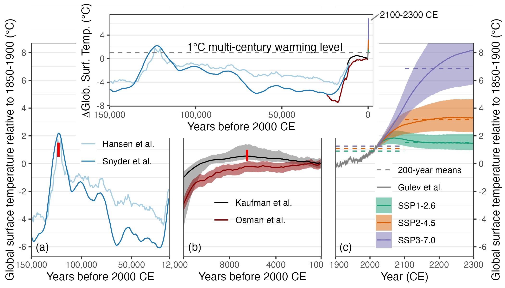

# Comparing past and future warming

This repository contains the code and data needed to reproduce Figure 1 from **Kaufman, Darrell S. and McKay, Nicholas P, 2021, Technical Note: Past and future warming – Direct comparison on multi-century timescales. Climate of the Past Discussions. 10.5194/cp-2021-146**. The article is open and [available here](https://cp.copernicus.org/preprints/cp-2021-146/). 

# Code

The code to reproduce this figure is written in R, and available in `figure1.R`. Several packages are required to run the code, and will need to be installed for the code to run. 

# Data

All of the data presented here are publicly available, and most have been compiled into a spreadsheet for convenience. 

## Instrumental temperature (1850-2020)
AR6-WGI assessed 4-dataset mean from Chapter 2 (HadCRUT, NOAA, Berkeley, Kadow)

Data in data/TemperatureData.xlsx

## Holocene temperature (12,000 yr BP to present)

### Temp12k multi-method reconstruction
Kaufman et al. (2020: 10.1038/s41597-020-0530-7)

Multi-method median reconstruction, 5-95 percentile ensemble range

Relative to 1800-1900 = 150-50 yr before 1950 = 100-200 yr before 2000

Ages are mid points of 100-year-long bins

Data in data/TemperatureData.xlsx

### Osman et al. SST-based Data Assimilation
Osman et al. (2021: 10.1038/s41586-021-03984-4)

Global data assimilation, global mean surface temperature, 5-95 percentile ensemble range

Subtracted 13.49°C to adjust absolute GMST to ∆ GMST relative to 1750-1950 = 200-0 yr before 1950 = 250-50 yr before 2000

Ages are mid points of 200-year-long bins

Data in data/LGMR_GMST_ens.nc, downloaded from https://www.ncei.noaa.gov/pub/data/paleo/reconstructions/osman2021/

## Lake Quaternary temperature

### Hansen et al. 2013

Benthic marine oxygen isotope (stacked) converted to GMST based on formulas from Hansen et al. (2013: 10.1098/rsta.2012.0294)

Subtracted 14.15°C to adjust absolute GMST to ∆ GMST and added 0.36°C to adjust 1961-1900 to 1850-1900

Data in data/TemperatureData.xlsx

### Snyder et al. 2016

Planctic marine oxygen isotope (stacked) scaled to ∆ GMST from Snyder (2016: 10.1038/nature19798)

Added 0.2°C to adjust ∆ GMST estimated for late Holocene to 1850-1900 based on Kaufman et al. (2020: 10.1038/s41597-020-0530-7)

Data in data/TemperatureData.xlsx

### Projections
From WG1- Table 4.5, based on multiple lines of evidence 5-95% ranges

MAGICC v7.5 output (reference?)

Subtract 0.85°C to adjust ∆ GMST to 1850-1900

Data in data/TemperatureData.xlsx

# References

Gulev, S. K., Thorne, P. W., Ahn, J., Dentener, F. J., Domingues, C. M., Gerland, S., Gong, D., Kaufman, D. S., Nnamchi, H. C., Quaas, J., Rivera, J. A., Sathyendranath, S., Smith, S. L., Trewin, B., von Shuckmann, K., and Vose, R. S.: Changing State of the Climate System, in: Climate Change 2021: The Physical Science Basis. Contribution of Working Group I to the Sixth Assessment Report of the Intergovernmental Panel on Climate Change, edited by: Masson-Delmotte, V., Zhai, P., Pirani, A., Connors, S. L., Péan, C., Berger, S., Caud, N., Chen, Y., Goldfarb, L., Gomis, M. I., Huang, M., Leitzell, K., Lonnoy, E., Matthews, J. B. R., Maycock, T. K., Waterfield, T., Yelekçi, O., Yu, R., and Zhou, B., Cambridge University Press, https://www.ipcc.ch/report/ar6/wg1/downloads/report/IPCC_AR6_WGI_Chapter_02.pdf, 2021.

Hansen J., Sato, M., Russell, G., Kharecha, P.: Climate sensitivity, sea level and atmospheric carbon dioxide. Phil. Trans. R. Soc. A 371, 20120294, https://doi.org/10.1098/rsta.2012.0294, 2013

Kaufman, D., McKay, N., Routson, C., Erb, M., Dätwyler, C., Sommer, P., Heiri, O., and Davis, B.: Holocene global surface temperature: A multi-method reconstruction approach. Scientific Data, 7, 201, https://doi.org/10.1038/s41597-020-0530-7, 2020.

Meinshausen, M., Nicholls, Z. R. J., Lewis, J., Gidden, M. J., Vogel, E., Freund, M., Beyerle, U., Gessner, C., Nauels, A., Bauer, N., Canadell, J. G., Daniel, J. S., John, A., Krummel, P. B., Luderer, G., Meinshausen, N., Montzka, S. A., Rayner, P. J., Reimann, S., Smith, S. J., van den Berg, M., Velders, G. J. M., Vollmer, M. K., and Wang, R. H. J.: The shared socioeconomic pathway (SSP) greenhouse gas concentrations and their extensions to 2500. Geosci. Model Dev., 13, 3571–3605, https://doi.org/10.5194/gmd-13-3571-2020, 2020.

Osman, M. B., Tierney, J. E., Zhu, J., Tardif, R., Hakim, G., King, J., and Poulsen, C. J.: Globally resolved surface temperatures since the Last Glacial Maximum. Nature 599, 239-244, 2021.

Snyder, C. W.: Evolution of global temperature over the past two million years. Nature, 538, 226-228, https://doi.org/10.1038/nature19798, 2016.
