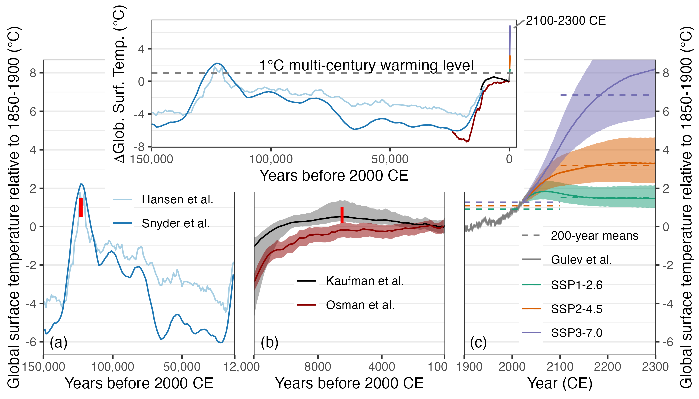

# Comparing past and future warming

This repository contains the code and data needed to reproduce Figure 1 from **Kaufman, Darrell S. and McKay, Nicholas P, 2021, Technical Note: Past and future warming – Direct comparison on multi-century timescales. Climate of the Past Discussions. 10.5194/cp-2021-146**. The article is open and [available here](https://cp.copernicus.org/preprints/cp-2021-146/). 

## Instrumental temperature (1850-2020)
AR6-WGI assessed 4-dataset mean from Chapter 2 (HadCRUT, NOAA, Berkeley, Kadow)

Data in data/TemperatureData.xlsx

## Holocene temperature (12,000 yr BP to present)

### Temp12k multi-method reconstruction
Kaufman et al. (2020: 10.1038/s41597-020-0530-7)

Multi-method median reconstruction, 5-95 percentile ensemble range

Relative to 1800-1900 = 150-50 yr before 1950 = 100-200 yr before 2000

Ages are mid points of 100-year-long bins

Data in data/TemperatureData.xlsx

### Osman et al. SST-based Data Assimilation
Osman et al. (2021: 10.1038/s41586-021-03984-4)

Global data assimilation, global mean surface temperature, 5-95 percentile ensemble range

Subtracted 13.49°C to adjust absolute GMST to ∆ GMST relative to 1750-1950 = 200-0 yr before 1950 = 250-50 yr before 2000

Ages are mid points of 200-year-long bins

Data in data/LGMR_GMST_ens.nc, downloaded from https://www.ncei.noaa.gov/pub/data/paleo/reconstructions/osman2021/

## Lake Quaternary temperature

### Hansen et al. 2013

Benthic marine oxygen isotope (stacked) converted to GMST based on formulas from Hansen et al. (2013: 10.1098/rsta.2012.0294)

Subtracted 14.15°C to adjust absolute GMST to ∆ GMST and added 0.36°C to adjust 1961-1900 to 1850-1900

Data in data/TemperatureData.xlsx

### Snyder et al. 2016

Planctic marine oxygen isotope (stacked) scaled to ∆ GMST from Snyder (2016: 10.1038/nature19798)

Added 0.2°C to adjust ∆ GMST estimated for late Holocene to 1850-1900 based on Kaufman et al. (2020: 10.1038/s41597-020-0530-7)

Data in data/TemperatureData.xlsx

### Projections
From WG1- Table 4.5, based on multiple lines of evidence 5-95% ranges

MAGICC v7.5 output (reference?)

Subtract 0.85°C to adjust ∆ GMST to 1850-1900

Data in data/TemperatureData.xlsx